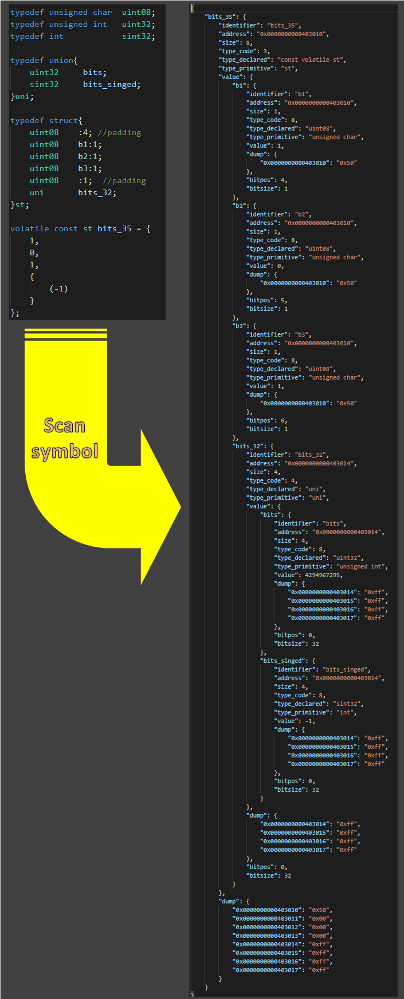

Scan symbol(s) utility module

# About each modules

 - gdbnaut.py  
   
   Scan symbol(s) in GDB.  

 - gdbnaut_nogdb.py  

   Reuse the scanning result without GDB.  

# attributes

| attribute name | description                                                                                   |
| :------------- | :-------------------------------------------------------------------------------------------- |
| identifier     | Name                                                                                          |
| address        | Memory address                                                                                |
| size           | Byte size                                                                                     |
| type_code      | Classification of type represented by integer                                                 |
| type_declared  | Type declaration in source code                                                               |
| type_primitive | Type definition which is removed const, volatile, and typedef converting from `type_declared` |
| value          | Content of variable ※1                                                                        |
| dump           | Memory dump igame                                                                             |

※1  
If the specified symbol is a variable, value is inferred from type declaration.  
If the specified symbol is a function, this attribute is not generated.  

## special attributes for fields of struct and union 

| attribute name | description                                                                                            |
| :------------- | :----------------------------------------------------------------------------------------------------- |
| bitpos         | Bit position from memory address. If bit field is not defined, the value of this attribute is `0`      |
| bitsize        | Bit size. If bit field is not defined, the value of this attribute is same as 8 times `size` attribute |

## special attributes for fields of enum

| attribute name | description                                         |
| :------------- | :-------------------------------------------------- |
| enum_dict      | Dictionary object which represents enum dectalation |

# limitation

 - C でしか動確してないよ

 - デバッグ対象の実行ファイルのパスに ASCII 以外の文字が含まれている場合、  
   `gdb.execute("info sybool 0x??????",False,True)` でコケる

# Known issues

## Real name in typedef expression

 - 配列宣言とポインタ変数宣言に対しては、Real name を取得できない  

   mingw-w64-x86_64-gcc 9.2.0-2 & mingw-w64-x86_64-gdb 8.3-9 環境、  
   gcc-core 7.4.0-1 & gdb 8.1.1-1 環境 で発生。

 - struct, union, enum に対する typedef を使用した変数を宣言しても、Real name を取得できない  

   例えば、`typedef struct st_name{ char c; int i; }st;` のように宣言していた場合、  
   `type_primitive` の値は `struct st_name` になるべきだけど、`st` となってしまう。

   gcc-core 7.4.0-1 & gdb 8.1.1-1 環境で発生。  
   GDBが返す gdb.Type オブジェクトの .name 属性が `None` になってしまうために発生する。  